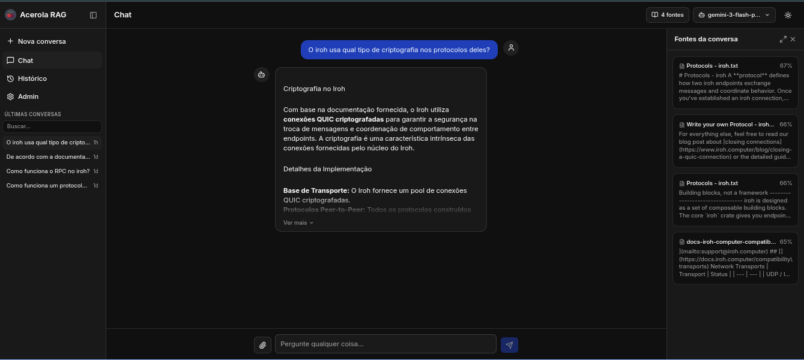
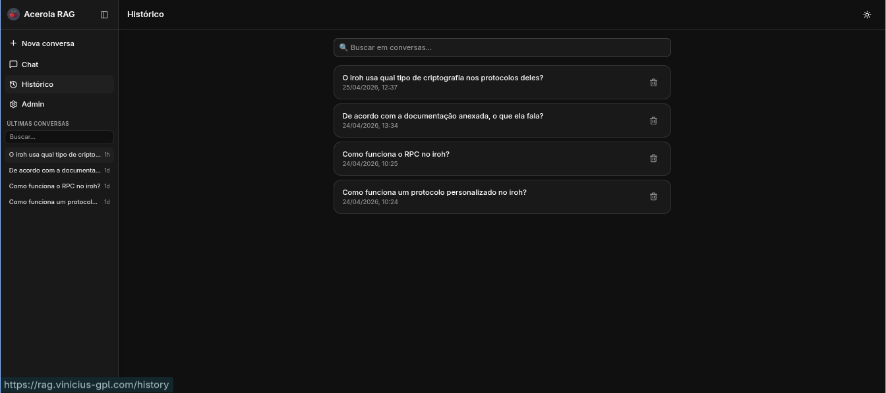
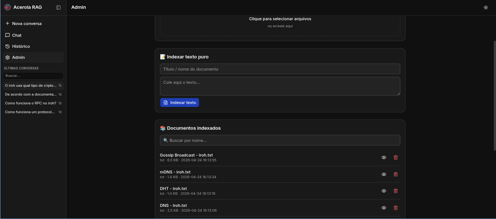
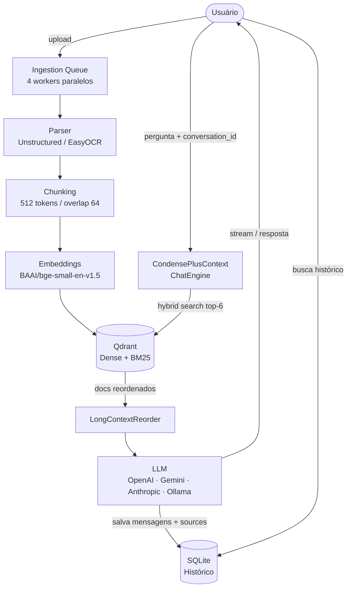
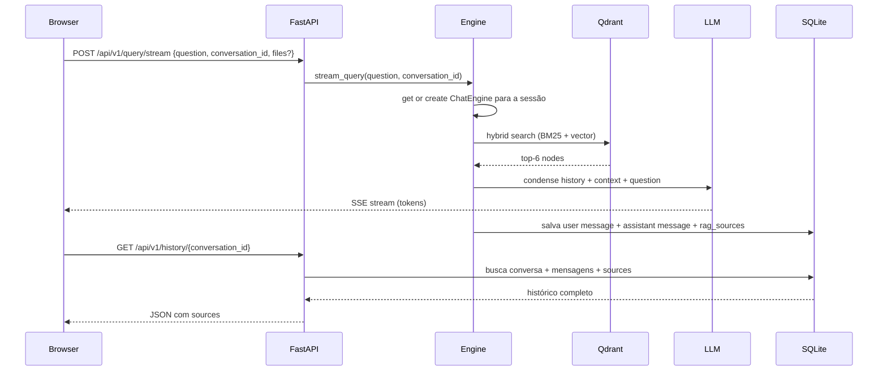

# Acerola RAG

Sistema de Retrieval-Augmented Generation (RAG) que permite fazer perguntas sobre documentos carregados, usando LLMs como OpenAI, Gemini, Anthropic ou Ollama.

## Screenshots

<table>
  <tr>
    <td align="center"><b>Chat</b></td>
    <td align="center"><b>Histórico</b></td>
    <td align="center"><b>Admin</b></td>
  </tr>
  <tr>
    <td></td>
    <td></td>
    <td></td>
  </tr>
</table>

## Arquitetura



## Fluxo de sessão



## Stack

| Camada | Tecnologias |
|--------|-------------|
| Frontend | SvelteKit 2 · Svelte 5 · Tailwind CSS 4 · shadcn-svelte |
| Backend | FastAPI · LlamaIndex · Uvicorn |
| LLMs | OpenAI · Gemini · Anthropic · Ollama |
| Vector store | Qdrant v1.17 (dense + BM25 híbrido) |
| Histórico | SQLite (conversas · mensagens · sources · FTS5) |
| Parsing | Unstructured · EasyOCR · Poppler |
| Observabilidade | Langfuse v3 · OpenInference (opcional) |

## Rodando localmente

```bash
# 1. Qdrant
docker run -d -p 6333:6333 qdrant/qdrant:v1.17.0

# 2. Backend
cd backend
pip install -r requirements.txt
cp .env.example .env   # preencha as chaves
python -m backend.main

# 3. Frontend (dev)
cd frontend
npm install
npm run dev
```

Ou usando Docker Compose (requer Traefik externo):

```bash
cp backend/.env.example backend/.env   # preencha as chaves
docker compose -f docker/compose.yml up -d
```

## Variáveis de ambiente

| Variável | Descrição |
|----------|-----------|
| `LLM_PROVIDER` | `openai` \| `gemini` \| `claude` \| `ollama` |
| `LLM_MODEL` | Ex: `gpt-4o-mini`, `gemini-2.5-flash` |
| `LLM_TEMPERATURE` | Temperatura do LLM (default `0.1`) |
| `LLM_MAX_TOKENS` | Máximo de tokens na resposta (default `1024`) |
| `OPENAI_API_KEY` | Chave OpenAI |
| `GEMINI_API_KEY` | Chave Gemini |
| `ANTHROPIC_API_KEY` | Chave Anthropic |
| `OLLAMA_BASE_URL` | URL do Ollama (default `http://localhost:11434/v1`) |
| `EMBED_MODEL` | Modelo de embeddings (default `BAAI/bge-small-en-v1.5`) |
| `EMBED_DIM` | Dimensão dos embeddings (default `384`) |
| `CHUNK_SIZE` | Tamanho dos chunks em tokens (default `512`) |
| `CHUNK_OVERLAP` | Overlap dos chunks (default `64`) |
| `QDRANT_HOST` | Host do Qdrant (default `127.0.0.1`) |
| `QDRANT_PORT` | Porta do Qdrant (default `6333`) |
| `LANGFUSE_PUBLIC_KEY` | Chave pública Langfuse (opcional) |
| `LANGFUSE_SECRET_KEY` | Chave secreta Langfuse (opcional) |
| `LANGFUSE_BASE_URL` | URL do Langfuse (default `https://cloud.langfuse.com`) |
| `DEBUG` | Habilita logs detalhados (default `false`) |

## Licença

Veja [LICENSE](./LICENSE).
